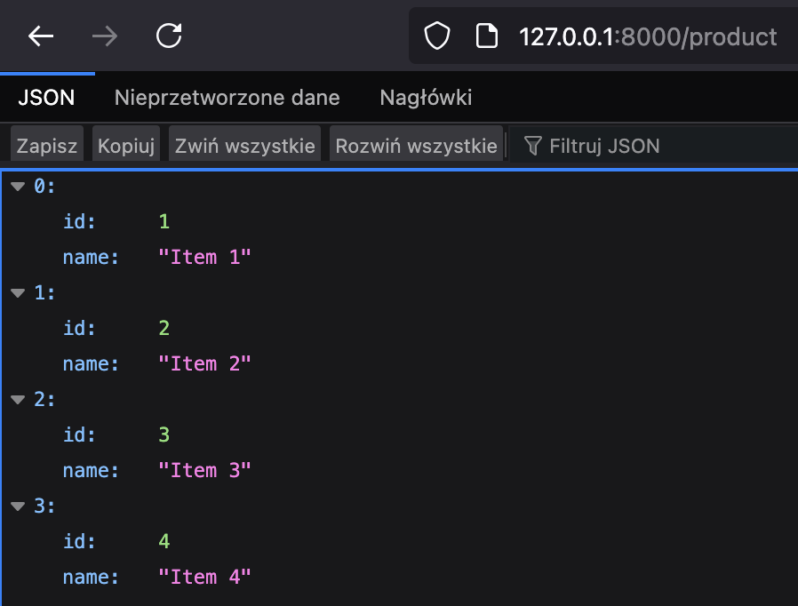
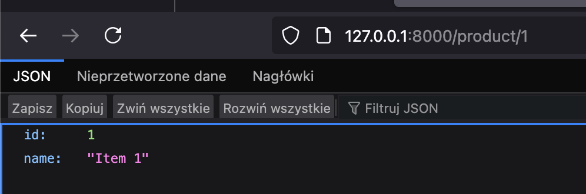

## Zadanie 1 Paradigms

✅ 3.0 wymaganie 1 [commit](https://github.com/mdros/uj-objective-programming/commit/53d52c86e6579a4029fe7dd17d13e1ca2abd48b2)

✅ 3.5 wymaganie 2 [commit](https://github.com/mdros/uj-objective-programming/commit/b1d196bc4de839ce3e1a6ba32ee4f531dba5e05e)

✅ 4.0 wymaganie 3 [commit](https://github.com/mdros/uj-objective-programming/commit/b1d196bc4de839ce3e1a6ba32ee4f531dba5e05e)

❌ 4.5 wymaganie 4 -

❌ 5.0 wymaganie 5 -

Kod: ./exercise-1-paradigms

## Zadanie 2 Symfony

✅ 3.0 wymaganie 1 [commit](https://github.com/mdros/uj-objective-programming/commit/c64740e26dfeec25b1083492cdd60f2932f9d993)

❌ 3.5 wymaganie 2 

❌ 4.0 wymaganie 3

❌ 4.5 wymaganie 4 -

❌ 5.0 wymaganie 5 -

Kod: ./exercise-2

